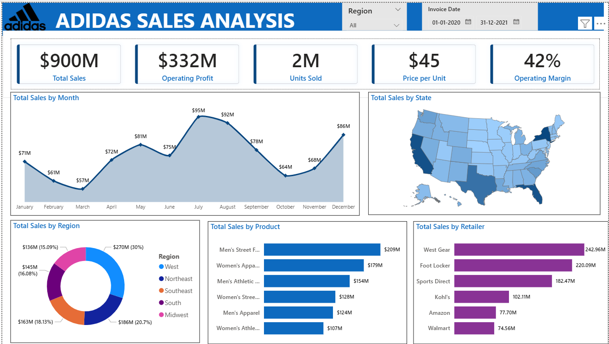

# 👟 Adidas Sales Analysis Dashboard – Power BI Project


---

# 📌 Project Overview

This project focuses on analyzing **Adidas Sales Data** using **Power BI** to uncover meaningful business insights, sales trends, customer behavior, regional performance, and product profitability.

The dashboard provides interactive visualizations that help businesses make data-driven decisions by identifying:

* 📈 Sales Growth Trends
* 🛍️ Best-Selling Products
* 🌍 Regional Sales Performance
* 💰 Profit & Revenue Analysis
* 🧑‍🤝‍🧑 Customer Purchasing Patterns
* 📊 Retailer Performance

---

# 🎯 Objectives

✅ Analyze Adidas sales performance across different regions

✅ Identify top-performing products and retailers

✅ Visualize monthly and yearly sales trends

✅ Understand profit distribution and operating margins

✅ Build an interactive dashboard for business decision-making

---

# 🧰 Tools & Technologies Used

| Tool                    | Purpose                                 |
| ----------------------- | --------------------------------------- |
| Power BI                | Data Visualization & Dashboard Creation |
| Excel / CSV             | Dataset Source                          |
| Power Query             | Data Cleaning & Transformation          |
| Charts & Visualizations | Dashboard Insights & Reporting          |

---

# 📂 Dataset Information

The dataset contains sales-related information such as:

* Retailer
* Retailer ID
* Invoice Date
* Region
* State
* City
* Product
* Price per Unit
* Units Sold
* Total Sales
* Operating Profit
* Operating Margin
* Sales Method


---

# ✨ Dashboard Features

## 📊 Sales Performance Analysis

* Total Revenue
* Total Profit
* Units Sold
* Sales Trend Over Time

## 🌍 Regional Analysis

* Region-wise Sales Distribution
* State-wise Performance
* Geographic Insights

## 🛒 Product Insights

* Top-Selling Products
* Product Category Comparison
* Profit Contribution by Product

## 🏬 Retailer Analysis

* Best Performing Retailers
* Retailer-wise Revenue Contribution

## 📅 Time Series Analysis

* Monthly Sales Trends
* Yearly Growth Analysis
* Seasonal Sales Patterns

---

# 📸 Dashboard Preview

> Add your dashboard screenshots here

```md

```

---

# 📈 Key Insights

🔹 Certain regions contributed significantly higher sales compared to others.

🔹 A few product categories generated maximum profit.

🔹 Seasonal trends affected Adidas sales performance.

🔹 Retailer performance varied greatly across locations.

🔹 Interactive filters improved business analysis efficiency.

---

# 🧠 Skills Demonstrated

✔ Data Cleaning

✔ Data Visualization

✔ Dashboard Creation

✔ Business Analysis

✔ Interactive Reporting

✔ Power BI Basics

✔ Analytical Thinking

---

# 🚀 How to Use

1. Download the `.pbix` file.
2. Open using **Power BI Desktop**.
3. Refresh the dataset if required.
4. Explore the interactive dashboard using filters and slicers.

---

# 📁 Project Structure

```bash
📦 Adidas-Sales-PowerBI-Project
 ┣ 📂 Dataset
 ┃ ┗ 📄 Adidas_Sales.csv
 ┣ 📂 Images
 ┃ ┗ 📄 Dashboard.png
 ┣ 📄 Adidas_Sales_Dashboard.pbix
 ┗ 📄 README.md
```

---

# 🌟 Future Improvements

* Add predictive sales forecasting
* Integrate real-time data updates
* Improve dashboard responsiveness
* Add customer segmentation analysis

---

# 🤝 Connect With Me

## 👨‍💻 Author

**Goutham Baggu**

📧 Email: [your-email@example.com](mailto:goutham.baggu5086@gmail.com)
🔗 LinkedIn: [https://linkedin.com/in/yourprofile](https://linkedin.com/in/[yourprofile](https://www.linkedin.com/in/goutham-baggu-a0202728b/))
💻 GitHub: [https://github.com/yourusername](https://github.com/GouthamBaggu)

---

# ⭐ If you like this project

Give this repository a ⭐ and support the project!

---

# 📌 Conclusion

This Power BI project demonstrates how business intelligence tools can transform raw sales data into actionable insights. The Adidas Sales Dashboard helps analyze trends, monitor KPIs, and improve strategic business decisions through interactive visual storytelling.
